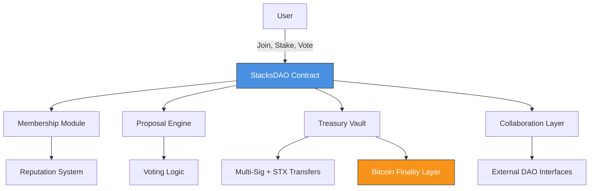

# StacksDAO – Bitcoin-Compatible DAO Framework

**StacksDAO** is a modular, Bitcoin-secured framework for decentralized autonomous organizations (DAOs) built on the [Stacks blockchain](https://www.stacks.co/). It provides a robust governance system with reputation-weighted voting, cross-DAO collaboration, and secure treasury operations — all anchored to Bitcoin's finality.

## ⚙️ Key Features

* ✅ **Reputation-Based Governance** with stake-weighted voting
* 🔐 **Secure Multi-Sig Treasury** for STX management
* 🤝 **Cross-DAO Collaboration** for shared proposals and execution
* ⏱️ **Time-Locked Proposals** and inactivity-based reputation decay
* 🔄 **Upgradeable & Modular** for various governance styles
* ⚡ **Bitcoin Finality** through Stacks' Proof-of-Transfer (PoX)

## 🧱 Architecture



### 🔍 Components

| Module                  | Description                                                         |
| ----------------------- | ------------------------------------------------------------------- |
| **Membership**          | DAO onboarding, staking, and lifecycle control                      |
| **Reputation System**   | Dynamic scores for participation, decay on inactivity               |
| **Proposal Engine**     | Create, vote, and execute DAO proposals                             |
| **Voting Logic**        | `(Reputation × 10) + STX Stake` weighted votes, supports delegation |
| **Treasury Vault**      | STX donations, multi-sig withdrawals, transparent audit trail       |
| **Collaboration Layer** | Enables trust-minimized proposals across DAOs                       |


## 🚀 Getting Started

### 🔧 Prerequisites

* [Clarinet](https://docs.hiro.so/clarinet) v1.5.0+
* [Stacks.js](https://github.com/stacks-js) v6.x
* Bitcoin testnet environment

### 📦 Installation

```bash
git clone https://github.com/prince-marvelous/stacks-dao.git
cd stacks-dao
npm install
clarinet check
```

### 🚀 Deployment

```bash
clarinet deployments stacks-dao --testnet
```

---

## 🧪 Usage Examples

### ✅ Join the DAO

```clojure
(contract-call? .stacksdao join-dao)
```

### 💰 Stake/Unstake STX

```clojure
(contract-call? .stacksdao stake-tokens u1000)
(contract-call? .stacksdao unstake-tokens u500)
```

### 🗳️ Propose and Vote

```clojure
(contract-call? .stacksdao create-proposal "Migrate Treasury" "Move funds to v2 vault" u2000)
(contract-call? .stacksdao vote-on-proposal u1 true)
(contract-call? .stacksdao execute-proposal u1)
```

### 🏦 Treasury Interaction

```clojure
(contract-call? .stacksdao donate-to-treasury u1000)
```

### 🔗 DAO-to-DAO Collaboration

```clojure
(contract-call? .stacksdao propose-collaboration .partnerdao u1)
(contract-call? .stacksdao accept-collaboration u101)
```

### ♻️ Reputation Decay

```clojure
(contract-call? .stacksdao decay-inactive-members)
```

---

## 🔐 Security Model

### Layers of Protection

| Layer                | Mechanism                                                           |
| -------------------- | ------------------------------------------------------------------- |
| **Access Control**   | Role-based entry points, `only-member`, and `contract-owner` guards |
| **Financial Safety** | Multi-sig treasury, donation limits, STX transfer fail-safes        |
| **Reputation Guard** | Auto-decay for inactive users, reputation floor, anti-Sybil voting  |

### Decay Logic

```clojure
(reputation = reputation / 2) ; after 30 days of inactivity
```

---

## 📊 Governance Rules

* 🧮 **Voting Power** = `(reputation × 10) + staked STX`
* 🎯 **Reputation Gain**:

  * +1 per vote
  * +2 per donation
  * +5 on successful proposal execution
* 🕒 **Decay Trigger**: 30 days without DAO activity

---

## 📚 Read-Only Functions

```clojure
(get-member-reputation principal)
(get-member principal)
(get-proposal uint)
(get-total-members)
(get-total-proposals)
```

---

## 🚫 Error Codes

| Code | Meaning              |
| ---- | -------------------- |
| 100  | Not authorized       |
| 101  | Already a member     |
| 102  | Not a member         |
| 103  | Invalid proposal ID  |
| 104  | Proposal expired     |
| 105  | Already voted        |
| 106  | Insufficient funds   |
| 107  | Invalid stake/amount |

---

## 🤝 Contributing

We welcome community contributions!

1. **Fork** the repo
2. **Create Branch**: `git checkout -b feature/xyz`
3. **Follow Clarity Style Guide**
4. **Write Tests**
5. **Submit PR**

## 🌐 Learn More

* [Stacks Documentation](https://docs.stacks.co/)
* [Clarity Language Guide](https://docs.stacks.co/write-smart-contracts/clarity-overview)
